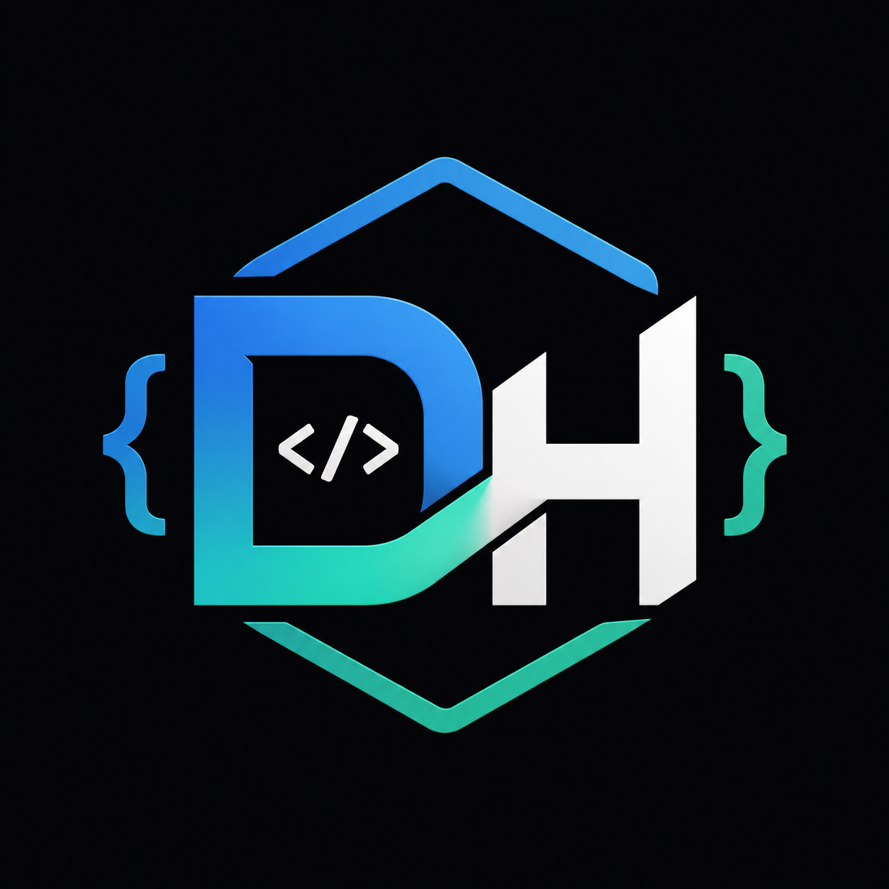

<p align="center">
  
</p>


# Developer Hub

> Sebuah database open-source yang berisi  **Sumber Daya Developer** — API, SDK, library, framework, tools, dan bahasa pemrograman.  
> I often have trouble finding organized tool references in one place, so I finally tried to build this simple project.

[](LICENSE)
[](CONTRIBUTING.md)
[](.github/workflows/daily-update.yml)
[](.github/workflows/weekly-maintenance.yml)
[](.github/workflows/deploy-railway.yml)
[](https://developer-hub-production.up.railway.app)
[](https://developer-hub-production.up.railway.app)

**[🌐 Akses Website](https://developer-hub-production.up.railway.app)**

> ⚠️ This site is just an example/demo that I made, maybe you will still find bugs.
---

## Tentang Project Ini

Halo, Saya **Wandi** — seorang pengembang dari Indonesia. Project ini saya buat karena saya ingin ada satu tempat yang mudah dicari, terstruktur, dan bisa dipakai siapa saja untuk menemukan tools developer. Baik itu buat Android, web, backend, IoT, Termux, atau binary tools — semuanya ada di sini.

## 📊 Statistik Saat Ini

| Metrik | Jumlah |
|---|---|
| **Total Resource** | 1.066 |
| **Kategori** | 33 |
| **Bahasa Pemrograman** | 83 |
| **Open Source** | 1.037 (97%) |
| **Terawat** | 1.057 (99%) |
| **Punya GitHub** | 1.066 (100%) |
| **Punya Alternatif** | 197 |
| **Lisensi Terbanyak** | MIT, Apache-2.0 |

## ✨ Yang Bisa Kamu Lakukan

- **Cari resource** — pake search atau filter kategori/bahasa
- **Lihat detail** — deskripsi, lisensi, link resmi, GitHub, dokumentasi
- **Temukan alternatif** — setiap project punya rekomendasi project serupa
- **Lihat tech stacks** — kumpulan tools yang biasa dipakai bareng (Android Development, Python Backend, dll)
- **Trending & terbaru** — lihat project yang lagi populer atau baru diupdate
- **Akses via API** — semua data bisa diambil lewat REST API

## 📂 Kategori

| Kategori | Ikon | Jumlah | Kategori | Ikon | Jumlah |
|---|---|---|---|---|---|
| AI | 🤖 | 119 | Frontend | 🎨 | 110 |
| Android | 📱 | 72 | Database | 🗄️ | 63 |
| Backend | ⚙️ | 56 | Tools | 🔧 | 50 |
| DevOps | 🚀 | 47 | Libraries | 📦 | 46 |
| Cloud | ☁️ | 44 | Security | 🔒 | 43 |
| CLI Tools | 📁 | 38 | Mobile | 📲 | 35 |
| Game Development | 🎮 | 29 | Blockchain | ⛓️ | 29 |
| Languages | 💻 | 29 | Frameworks | 🏗️ | 28 |
| Containers | 🐳 | 28 | Network | 🌐 | 26 |
| Desktop | 🖥️ | 26 | macOS | 🍎 | 23 |
| Linux | 🐧 | 18 | Windows | 🪟 | 14 |
| Termux | 📱 | 13 | IoT | 📡 | 12 |
| Robotics | 🦾 | 12 | Android Tools | 📱 | 11 |
| Operating Systems | 💿 | 10 | Machine Learning | 🧠 | 10 |
| API | 🔗 | 9 | Web | 🌐 | 5 |
| Firmware | ⚡ | 8 | Embedded | 🔌 | 4 |
| Binary | 💾 | 3 | | | |

## 🔌 REST API

Semua data bisa diakses via API.  
**Base URL:** `https://developer-hub-production.up.railway.app`

| Endpoint | Fungsi |
|---|---|
| `GET /stats` | Statistik overview |
| `GET /projects` | Daftar project (bisa difilter per kategori) |
| `GET /projects/{id}` | Detail project + skor kualitas |
| `GET /search?q=` | Pencarian fuzzy |
| `GET /suggest?q=` | Autocomplete saran pencarian |
| `GET /trending` | Project yang lagi tren |
| `GET /stacks` | Tech stacks yang dikurasi |
| `GET /stacks/{id}` | Project dalam stack tertentu |
| `GET /recent` | Project yang baru diupdate |
| `GET /recommendations/{id}` | Rekomendasi project serupa |

Dokumentasi API lengkap: `/docs` (Swagger UI) atau `/redoc` (ReDoc).

## 🚀 Cara Pakai

```bash
# Clone repo
git clone https://github.com/soe1hom-arch/developer-hub.git
cd developer-hub

# Install
pip install -r scripts/requirements.txt

# Validasi data
python scripts/validate.py

# Jalankan server
uvicorn api_server.main:app --reload --host 0.0.0.0 --port 8000

# Buka website
open http://localhost:8000
```

## 🌐 Website

This website is just an example/demo; you can customize it with your own version. It includes a dark theme, search, filters, trending pages, tech stacks, and project details. Just access:

**[https://developer-hub-production.up.railway.app](https://developer-hub-production.up.railway.app)**

## 🤖 Otomatisasi

Saya pake GitHub Actions buat jaga kualitas data:

- **Tiap push** — validasi JSON, cek schema
- **Harian** — deteksi rilis baru, verifikasi link, update metadata
- **Mingguan** — scan penuh, deteksi project yang diarsipkan/ditinggalkan

## 🤝 Ikut Berkontribusi

Kamu boleh bantu nambahin resource atau laporin kalau ada yang salah:

- [Panduan Kontribusi](CONTRIBUTING.md)
- [Kode Etik](CODE_OF_CONDUCT.md)
- [Dokumentasi Lengkap](docs/)

## 📄 Lisensi

MIT License — silakan pakai, modifikasi, dan sebarkan. Lihat [LICENSE](LICENSE).

---

## 👤 About Me

Hello, I'm **Wandi** (@soe1hom-arch). I created this project in my spare time, based on my interests in Android, firmware, and open-source tools.

- 🔭 Sehari-hari saya fokus dengan Android development dan firmware
- 🌟 Saya juga bikin tools lain kayak [AFFT-Toolkit](https://github.com/soe1hom-arch/AFFT-Toolkit) dan [CalcDuo](https://github.com/soe1hom-arch/calcduo)
- 💬 Kalau ada pertanyaan atau feedback, [buka issue aja](https://github.com/soe1hom-arch/developer-hub/issues)

## ⚖️ Things You Need to Know

- All data is taken from public sources (GitHub, official website, documentation)
  

**Things to note:**
- Product names, logos, and trademarks belong to their respective owners
- I am not affiliated with any of the projects or companies listed
- I provide this data "as is" — always verify important information from official sources
- If any resource violates your rights, [report here](https://github.com/soe1hom-arch/developer-hub/issues) — I will review and delete if necessary.
